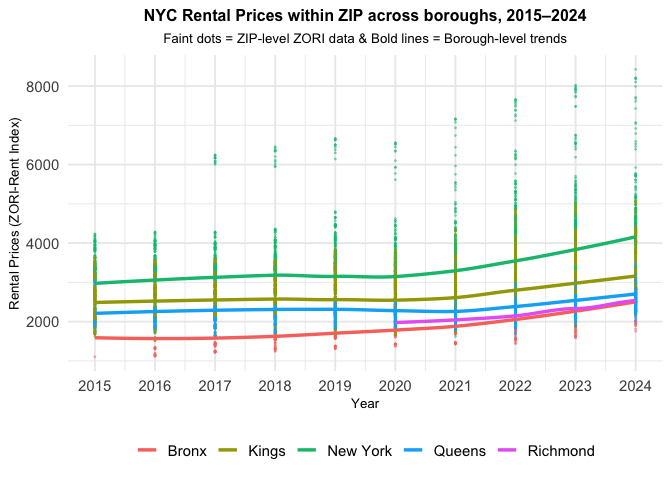
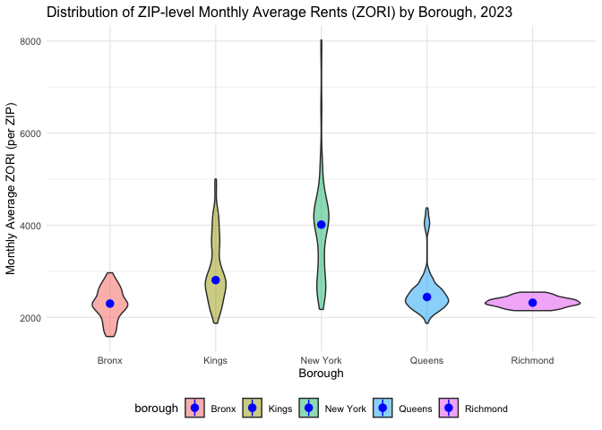
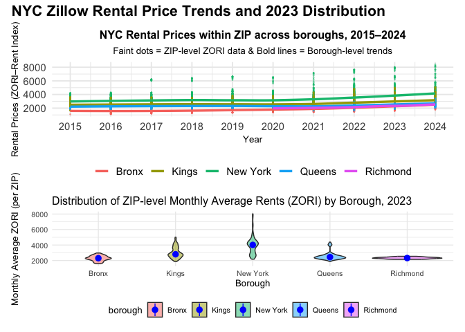
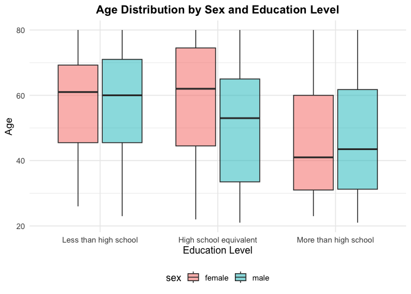
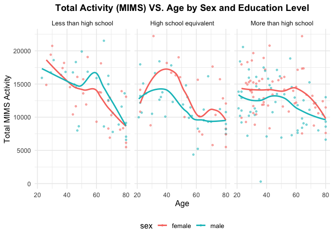
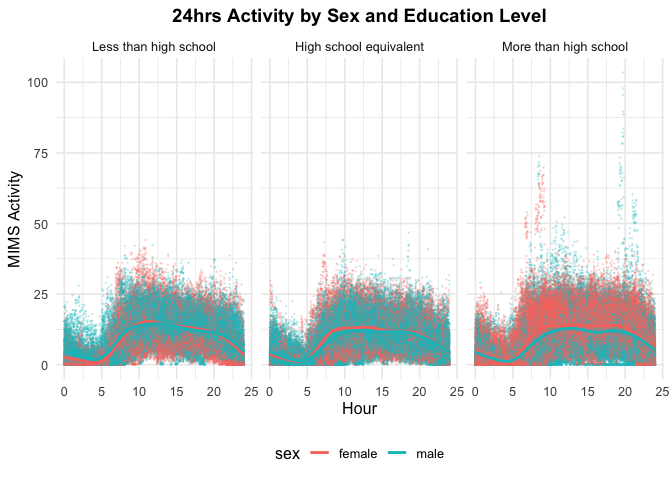

p8105_hw3_ym3077
================

Load packages

``` r
library(tidyverse)
```

    ## ── Attaching core tidyverse packages ──────────────────────── tidyverse 2.0.0 ──
    ## ✔ dplyr     1.1.4     ✔ readr     2.1.5
    ## ✔ forcats   1.0.0     ✔ stringr   1.5.1
    ## ✔ ggplot2   3.5.2     ✔ tibble    3.3.0
    ## ✔ lubridate 1.9.4     ✔ tidyr     1.3.1
    ## ✔ purrr     1.1.0     
    ## ── Conflicts ────────────────────────────────────────── tidyverse_conflicts() ──
    ## ✖ dplyr::filter() masks stats::filter()
    ## ✖ dplyr::lag()    masks stats::lag()
    ## ℹ Use the conflicted package (<http://conflicted.r-lib.org/>) to force all conflicts to become errors

``` r
library(lubridate)
library(ggplot2)
library(patchwork)
```

## Problem 1

``` r
library(p8105.datasets)
data("instacart")

instacart_summary = list(instacart)
head(instacart,10)
```

    ## # A tibble: 10 × 15
    ##    order_id product_id add_to_cart_order reordered user_id eval_set order_number
    ##       <int>      <int>             <int>     <int>   <int> <chr>           <int>
    ##  1        1      49302                 1         1  112108 train               4
    ##  2        1      11109                 2         1  112108 train               4
    ##  3        1      10246                 3         0  112108 train               4
    ##  4        1      49683                 4         0  112108 train               4
    ##  5        1      43633                 5         1  112108 train               4
    ##  6        1      13176                 6         0  112108 train               4
    ##  7        1      47209                 7         0  112108 train               4
    ##  8        1      22035                 8         1  112108 train               4
    ##  9       36      39612                 1         0   79431 train              23
    ## 10       36      19660                 2         1   79431 train              23
    ## # ℹ 8 more variables: order_dow <int>, order_hour_of_day <int>,
    ## #   days_since_prior_order <int>, product_name <chr>, aisle_id <int>,
    ## #   department_id <int>, aisle <chr>, department <chr>

This `instacart` dataset has 1384617 observations for 131,209 users and
15 variables/rows, where each row represents a product from a single
order and is associated with a customer.  
The 15 variables in this dataset are: `order_id` (order identifier),
`product_id` (product identifier), `add_to_cart_order` (order of each
product was added to cart), `reordered` (1 if ordered before, 0
otherwise), `user_id` (customer identifier), `eval_set` (which
evaluation this order belongs to), `order_number` (the order number for
this user, 1=first, n=nth), `order_dow` (the day of the week when this
order was placed), `order_hour_of_day` (the hour of the day when this
order was placed), `days_since_prior_order` (days since the last order,
capped at 30, NA if order_number=1), `product_name` (name of the
product), `aisle_id`(aisle identifier), `department_id` (department
identifier), `aisle` (the name of the aisle), `department` (department
this product belongs to).

``` r
n_aisles = instacart |>
  distinct(aisle) |>
  nrow()

aisle_summary = instacart |>
  group_by(aisle) |>
  summarize(n_orders = n()) |>
  arrange(desc(n_orders))

n_aisles
```

    ## [1] 134

``` r
aisle_summary
```

    ## # A tibble: 134 × 2
    ##    aisle                         n_orders
    ##    <chr>                            <int>
    ##  1 fresh vegetables                150609
    ##  2 fresh fruits                    150473
    ##  3 packaged vegetables fruits       78493
    ##  4 yogurt                           55240
    ##  5 packaged cheese                  41699
    ##  6 water seltzer sparkling water    36617
    ##  7 milk                             32644
    ##  8 chips pretzels                   31269
    ##  9 soy lactosefree                  26240
    ## 10 bread                            23635
    ## # ℹ 124 more rows

There are 134 aisles on the dataset, and fresh vegetables is the aisle
with the most items ordered from.

Plot the number of items ordered in each aisle (\>10000 orders)

``` r
aisle_plot = instacart |>
  group_by(aisle) |>
  summarize(n_orders = n()) |>
  filter(n_orders > 10000) |>
  mutate(aisle = fct_reorder(aisle, n_orders)) 

ggplot(aisle_plot, aes(x = aisle, y = n_orders)) + 
  geom_col(fill = "purple") +
  labs(
    title = "Items ordered by aisle (> 10000 orders)",
    x = "Aisle",
    y = "Number of items ordered") +
  theme_minimal(base_size = 10) +
  theme(axis.text.x = element_text(angle = 90, hjust = 1, vjust = 0.5))
```

<!-- -->

Table with three most popular items in “baking ingredients”, “dog food
care”, and “packaged vegetables fruits”

``` r
pop_items = instacart |>
  filter(aisle %in% c("baking ingredients", "dog food care", "packaged vegetables fruits")) |>
  group_by(aisle, product_name) |>
  summarize(n_orders = n()) |>
  arrange(aisle, desc(n_orders)) |>
  slice_head(n=3)
```

    ## `summarise()` has grouped output by 'aisle'. You can override using the
    ## `.groups` argument.

``` r
pop_items
```

    ## # A tibble: 9 × 3
    ## # Groups:   aisle [3]
    ##   aisle                      product_name                               n_orders
    ##   <chr>                      <chr>                                         <int>
    ## 1 baking ingredients         Light Brown Sugar                               499
    ## 2 baking ingredients         Pure Baking Soda                                387
    ## 3 baking ingredients         Cane Sugar                                      336
    ## 4 dog food care              Snack Sticks Chicken & Rice Recipe Dog Tr…       30
    ## 5 dog food care              Organix Chicken & Brown Rice Recipe              28
    ## 6 dog food care              Small Dog Biscuits                               26
    ## 7 packaged vegetables fruits Organic Baby Spinach                           9784
    ## 8 packaged vegetables fruits Organic Raspberries                            5546
    ## 9 packaged vegetables fruits Organic Blueberries                            4966

Table with mean hour of the day that Pink Lady Apples and Coffee Ice
Cream were ordered on each day of the weak

``` r
meanhour_table = instacart |>
  filter(product_name %in% c("Pink Lady Apples", "Coffee Ice Cream")) |>
  group_by(product_name, order_dow) |>
  summarize(
    mean_hour = mean(order_hour_of_day, na.rm = TRUE)) |>
  pivot_wider(
    names_from = order_dow,
    values_from = mean_hour) |>
  knitr::kable(digits = 1)
```

    ## `summarise()` has grouped output by 'product_name'. You can override using the
    ## `.groups` argument.

``` r
meanhour_table
```

| product_name     |    0 |    1 |    2 |    3 |    4 |    5 |    6 |
|:-----------------|-----:|-----:|-----:|-----:|-----:|-----:|-----:|
| Coffee Ice Cream | 13.8 | 14.3 | 15.4 | 15.3 | 15.2 | 12.3 | 13.8 |
| Pink Lady Apples | 13.4 | 11.4 | 11.7 | 14.2 | 11.6 | 12.8 | 11.9 |

## Problem 2

Import, clean, and otherwise tidy these datasets.

``` r
zillow <- read_csv("data/Zip_zori_uc_sfrcondomfr_sm_month_NYC.csv") |> 
 janitor::clean_names()
```

    ## Rows: 149 Columns: 125
    ## ── Column specification ────────────────────────────────────────────────────────
    ## Delimiter: ","
    ## chr   (6): RegionType, StateName, State, City, Metro, CountyName
    ## dbl (119): RegionID, SizeRank, RegionName, 2015-01-31, 2015-02-28, 2015-03-3...
    ## 
    ## ℹ Use `spec()` to retrieve the full column specification for this data.
    ## ℹ Specify the column types or set `show_col_types = FALSE` to quiet this message.

``` r
zipcode <- read_csv("data/Zip Codes.csv") |> 
 janitor::clean_names()
```

    ## Rows: 322 Columns: 7
    ## ── Column specification ────────────────────────────────────────────────────────
    ## Delimiter: ","
    ## chr (4): County, County Code, File Date, Neighborhood
    ## dbl (3): State FIPS, County FIPS, ZipCode
    ## 
    ## ℹ Use `spec()` to retrieve the full column specification for this data.
    ## ℹ Specify the column types or set `show_col_types = FALSE` to quiet this message.

``` r
zillow_clean <- zillow |> 
  pivot_longer(
    cols = starts_with("x"),
    names_to = "date",
    values_to = "zori"
  ) |>
  mutate(
    date = str_remove(date, "^x"),    
    date = ymd(date),               
    year = year(date),
    month = month(date, label = TRUE, abbr = FALSE),
    zip = as.character(region_name)
  )

zipcode_clean <- zipcode |> 
  select(zip_code, borough = county, neighborhood) |> 
  rename(zip = zip_code) |> 
  mutate(zip = as.character(zip))

zillow_merged <- left_join(zillow_clean, zipcode_clean, by = "zip", relationship = "many-to-many")

zillow_merged <- zillow_merged |>
  select(-state_name) |>
  select(zip, region_id, region_name, region_type, state, city, county_name, borough,
         neighborhood, year, month, date, zori, everything()) |>
  arrange(zip, year, match(month, month.name))

zillow_merged
```

    ## # A tibble: 17,516 × 15
    ##    zip   region_id region_name region_type state city     county_name    borough
    ##    <chr>     <dbl>       <dbl> <chr>       <chr> <chr>    <chr>          <chr>  
    ##  1 10001     61615       10001 zip         NY    New York New York Coun… New Yo…
    ##  2 10001     61615       10001 zip         NY    New York New York Coun… New Yo…
    ##  3 10001     61615       10001 zip         NY    New York New York Coun… New Yo…
    ##  4 10001     61615       10001 zip         NY    New York New York Coun… New Yo…
    ##  5 10001     61615       10001 zip         NY    New York New York Coun… New Yo…
    ##  6 10001     61615       10001 zip         NY    New York New York Coun… New Yo…
    ##  7 10001     61615       10001 zip         NY    New York New York Coun… New Yo…
    ##  8 10001     61615       10001 zip         NY    New York New York Coun… New Yo…
    ##  9 10001     61615       10001 zip         NY    New York New York Coun… New Yo…
    ## 10 10001     61615       10001 zip         NY    New York New York Coun… New Yo…
    ## # ℹ 17,506 more rows
    ## # ℹ 7 more variables: neighborhood <chr>, year <dbl>, month <ord>, date <date>,
    ## #   zori <dbl>, size_rank <dbl>, metro <chr>

There are 116 months between January 2015 and August 2024. How many ZIP
codes are observed 116 times? How many are observed fewer than 10 times?
Why are some ZIP codes are observed rarely and others observed in each
month?

``` r
zip_summary <- zillow_merged |>
  filter(!is.na(zori)) |>
  group_by(zip) |>
  summarize(n_months = n_distinct(date))

zip_116 <- zip_summary |>
  summarize(n = sum(n_months == 116))
zip_116
```

    ## # A tibble: 1 × 1
    ##       n
    ##   <int>
    ## 1    48

``` r
zip_10 <-zip_summary |>
  summarize(n = sum(n_months < 10))
zip_10
```

    ## # A tibble: 1 × 1
    ##       n
    ##   <int>
    ## 1    26

There are 48 ZIP codes are observed 116 times, and 26 ZIP codes are
observed fewer than 10 times. ZIP codes observed in each month might
locate at highly populated residential areas (ie. Manhattan) with
frequently updated rental markets information; while others are observed
rarely might locate at low residential activity area (ie. few rental
listings, industrial or commercial zones).

Create a reader-friendly table showing the average rental price in each
borough and year (not month). Comment on trends in this table.

``` r
borough_yr <- zillow_merged |>
  filter(!is.na(zori)) |>
  group_by(borough, year) |>
  summarize(
    mean_zori = mean(zori)) |>
  pivot_wider(
    names_from = year,
    values_from = mean_zori)
```

    ## `summarise()` has grouped output by 'borough'. You can override using the
    ## `.groups` argument.

``` r
borough_yr
```

    ## # A tibble: 5 × 11
    ## # Groups:   borough [5]
    ##   borough  `2015` `2016` `2017` `2018` `2019` `2020` `2021` `2022` `2023` `2024`
    ##   <chr>     <dbl>  <dbl>  <dbl>  <dbl>  <dbl>  <dbl>  <dbl>  <dbl>  <dbl>  <dbl>
    ## 1 Bronx     1760.  1520.  1544.  1639.  1706.  1811.  1858.  2054.  2285.  2497.
    ## 2 Kings     2493.  2520.  2546.  2547.  2631.  2555.  2550.  2868.  3015.  3126.
    ## 3 New York  3006.  3015.  3109.  3160.  3285.  3091.  3124.  3753.  3908.  4053.
    ## 4 Queens    2215.  2272.  2263.  2292.  2388.  2316.  2211.  2406.  2562.  2694.
    ## 5 Richmond    NA     NA     NA     NA     NA   1978.  2045.  2147.  2333.  2536.

Manhattan (New York County) has the highest price every year with a wide
margin. There’s a huge decrease during 2020–2021 followed by a sharp
rebound and new highs by 2023–2024.  
Brooklyn (Kings) and Queens sit in the middle tier with steady increases
through 2024. The Bronx is consistently the lowest-price borough, but it
still shows a clear upward trend over the decade. Richmond (Staten
Island) has missing early years, but from 2020 to 2024, it shows a
steady increase, consistent with post-pandemic recovery. Overall trend
across boroughs is slight growth pre-COVID, a decrease in 2020–2021, and
strong acceleration by 2022–2024, with Manhattan leading and Bronx
lowest throughout.

Make a plot showing NYC Rental Prices within ZIP codes for all available
years. Your plot should facilitate comparisons across boroughs. Comment
on any significant elements of this plot.

``` r
zip_trend = zillow_merged |>
  filter(!is.na(zori)) |>
  mutate(year = as.integer(year)) |>
  select(borough, zip, year, zori)

ggplot(zip_trend, aes(x = year, y = zori, color = borough)) +
  geom_point(aes(group = zip), alpha = 0.4, size = 0.3) +
  geom_smooth(se = FALSE, method = "loess", na.rm = TRUE, size = 1.2) +
  labs(
    title = "NYC Rental Prices within ZIP across boroughs, 2015–2024",
    subtitle = "Faint dots = ZIP-level ZORI data & Bold lines = Borough-level trends",
    x = "Year", y = "Rental Prices (ZORI-Rent Index)", color = "Borough") +
  scale_x_continuous(breaks = 2015:2024) +
  theme_minimal(base_size = 14) +
  theme(
    legend.position = "bottom",
    legend.title = element_blank(),
    plot.title = element_text(face = "bold", size = 12, hjust = 0.5),
    plot.subtitle = element_text(size = 10, hjust = 0.5),
    axis.title = element_text(size = 10))
```

    ## Warning: Using `size` aesthetic for lines was deprecated in ggplot2 3.4.0.
    ## ℹ Please use `linewidth` instead.
    ## This warning is displayed once every 8 hours.
    ## Call `lifecycle::last_lifecycle_warnings()` to see where this warning was
    ## generated.

    ## `geom_smooth()` using formula = 'y ~ x'

    ## Warning in simpleLoess(y, x, w, span, degree = degree, parametric = parametric,
    ## : pseudoinverse used at 2024

    ## Warning in simpleLoess(y, x, w, span, degree = degree, parametric = parametric,
    ## : neighborhood radius 2.02

    ## Warning in simpleLoess(y, x, w, span, degree = degree, parametric = parametric,
    ## : reciprocal condition number 2.3021e-16

    ## Warning in simpleLoess(y, x, w, span, degree = degree, parametric = parametric,
    ## : There are other near singularities as well. 1

<!-- -->
This plot shows the steadily increasing trend across all boroughs from
2015 to 2024 with a noticeable acceleration starting 2021, likely
reflecting the post-pandemic recovery on rental prices and rising
housing demand. Another significant element is a clear gap between
boroughs gets wider over time, reflecting unequal growth in rental
markets across the city. Last, but not the least, New York (Manhattan)
consistently has the highest rental prices, followed by Kings
(Brooklyn), Queens, and then Richomond (Staten Island) and Bronx.

Compute the average rental price within each ZIP code over each month in
2023. Make a reader-friendly plot showing the distribution of
ZIP-code-level rental prices across boroughs; put differently, your plot
should facilitate the comparison of the distribution of average rental
prices across boroughs. Comment on this plot

``` r
zip_2023 <- zillow_merged |>
  filter(!is.na(zori), year(date) == 2023) |>
  mutate(month = month(date)) |>
  group_by(borough, zip, month) |>
  summarize(avg_zori = mean(zori, na.rm = TRUE)) |>
  mutate(borough = fct_reorder(borough, avg_zori))
```

    ## `summarise()` has grouped output by 'borough', 'zip'. You can override using
    ## the `.groups` argument.

``` r
ggplot(zip_2023, aes(x = borough, y = avg_zori, fill = borough)) +
  geom_violin(alpha = 0.5) +
  stat_summary(fun = "median", color = "blue") +
  labs(
    title = "Distribution of ZIP-level Monthly Average Rents (ZORI) by Borough, 2023",
    x = "Borough",
    y = "Monthly Average ZORI (per ZIP)" ) +
  theme_minimal(base_size = 10) +
  theme(legend.position = "bottom")
```

    ## Warning: Removed 5 rows containing missing values or values outside the scale range
    ## (`geom_segment()`).

<!-- -->
This violin plot shows the distribution of ZIP-level average monthly
rental prices (ZORI) across NYC 5 boroughs in 2023. New York(Manhattan)
shows the highest rental prices with widest spread, reflecting large
variation across zip codes. Kings(Brooklyn) ranks second with a
moderately wide distribution, suggesting small but noticeable
variability within the borough. Queens and Bronx have lower median rent
prices, around 2250 with comparatively tighter spreads. Richmond (Staten
Island) has the lowest and uniform rent distribution, reflecting more
consistent housing rental prices within the borough.

Combine the two previous plots into a single graphic, and export this to
a results folder in your repository.

``` r
zip_trend_plot = zillow_merged |>
  filter(!is.na(zori)) |>
  mutate(year = as.integer(year)) |>
  select(borough, zip, year, zori) |>
  ggplot(aes(x = year, y = zori, color = borough)) +  
  geom_point(aes(group = zip), alpha = 0.4, size = 0.3) +
  geom_smooth(se = FALSE, method = "loess", na.rm = TRUE, size = 1.2) +
  labs(
    title = "NYC Rental Prices within ZIP across boroughs, 2015–2024",
    subtitle = "Faint dots = ZIP-level ZORI data & Bold lines = Borough-level trends",
    x = "Year", 
    y = "Rental Prices (ZORI–Rent Index)",
    color = "Borough"
  ) +
  scale_x_continuous(breaks = 2015:2024) +
  theme_minimal(base_size = 14) +
  theme(
    legend.position = "bottom",
    legend.title = element_blank(),
    plot.title = element_text(face = "bold", size = 12, hjust = 0.5),
    plot.subtitle = element_text(size = 10, hjust = 0.5),
    axis.title = element_text(size = 10)
  )

zip_2023_plot = zillow_merged |>
  filter(!is.na(zori), year(date) == 2023) |>
  mutate(month = month(date)) |>
  group_by(borough, zip, month) |>
  summarize(avg_zori = mean(zori, na.rm = TRUE)) |>
  mutate(borough = fct_reorder(borough, avg_zori)) |>
  ggplot(aes(x = borough, y = avg_zori, fill = borough)) +
  geom_violin(alpha = 0.5) +
  stat_summary(fun = "median", color = "blue") +
  labs(
    title = "Distribution of ZIP-level Monthly Average Rents (ZORI) by Borough, 2023",
    x = "Borough",
    y = "Monthly Average ZORI (per ZIP)" ) +
  theme_minimal(base_size = 10) +
  theme(legend.position = "bottom")
```

    ## `summarise()` has grouped output by 'borough', 'zip'. You can override using
    ## the `.groups` argument.

``` r
combined_plot = zip_trend_plot / zip_2023_plot +
  plot_annotation(
    title = "NYC Zillow Rental Price Trends and 2023 Distribution",
    theme = theme(plot.title = element_text(face = "bold", size = 16))
  )
combined_plot
```

    ## `geom_smooth()` using formula = 'y ~ x'

    ## Warning in simpleLoess(y, x, w, span, degree = degree, parametric = parametric,
    ## : pseudoinverse used at 2024

    ## Warning in simpleLoess(y, x, w, span, degree = degree, parametric = parametric,
    ## : neighborhood radius 2.02

    ## Warning in simpleLoess(y, x, w, span, degree = degree, parametric = parametric,
    ## : reciprocal condition number 2.3021e-16

    ## Warning in simpleLoess(y, x, w, span, degree = degree, parametric = parametric,
    ## : There are other near singularities as well. 1

    ## Warning: Removed 5 rows containing missing values or values outside the scale range
    ## (`geom_segment()`).

<!-- -->

``` r
ggsave("results/nyc_rent_combined_plot.png", combined_plot, width = 10, height = 20, dpi = 300)
```

    ## `geom_smooth()` using formula = 'y ~ x'

    ## Warning in simpleLoess(y, x, w, span, degree = degree, parametric = parametric,
    ## : pseudoinverse used at 2024

    ## Warning in simpleLoess(y, x, w, span, degree = degree, parametric = parametric,
    ## : neighborhood radius 2.02

    ## Warning in simpleLoess(y, x, w, span, degree = degree, parametric = parametric,
    ## : reciprocal condition number 2.3021e-16

    ## Warning in simpleLoess(y, x, w, span, degree = degree, parametric = parametric,
    ## : There are other near singularities as well. 1

    ## Warning: Removed 5 rows containing missing values or values outside the scale range
    ## (`geom_segment()`).

## Problem 3

Load, tidy, merge, and otherwise organize the data sets. Your final
dataset should include all originally observed variables; exclude
participants less than 21 years of age, and those with missing
demographic data; and encode data with reasonable variable classes
(i.e. not numeric, and using factors with the ordering of tables and
plots in mind).

``` r
nhanes_accel <- read_csv("data/nhanes_accel.csv") |> 
  janitor::clean_names()
```

    ## Rows: 250 Columns: 1441
    ## ── Column specification ────────────────────────────────────────────────────────
    ## Delimiter: ","
    ## dbl (1441): SEQN, min1, min2, min3, min4, min5, min6, min7, min8, min9, min1...
    ## 
    ## ℹ Use `spec()` to retrieve the full column specification for this data.
    ## ℹ Specify the column types or set `show_col_types = FALSE` to quiet this message.

``` r
nhanes_covar <- read_csv("data/nhanes_covar.csv", skip = 4) |> 
  janitor::clean_names()
```

    ## Rows: 250 Columns: 5
    ## ── Column specification ────────────────────────────────────────────────────────
    ## Delimiter: ","
    ## dbl (5): SEQN, sex, age, BMI, education
    ## 
    ## ℹ Use `spec()` to retrieve the full column specification for this data.
    ## ℹ Specify the column types or set `show_col_types = FALSE` to quiet this message.

``` r
covar_clean = nhanes_covar |> 
  filter(age >= 21) |>
  drop_na(sex, education, bmi, age) |> 
  mutate(
    sex = recode(sex, `1` = "male", `2` = "female"),
    education = recode(education, 
                       `1` = "Less than high school", 
                       `2` = "High school equivalent", 
                       `3` = "More than high school"),
    sex = factor(sex),
    education = factor(education, levels = c("Less than high school", "High school equivalent", "More than high school")),
    age = as.numeric(age),
    bmi = as.numeric(bmi))

nhanes_merged <- left_join(covar_clean, nhanes_accel, by = "seqn")
```

Produce a reader-friendly table for the number of men and women in each
education category, and create a visualization of the age distributions
for men and women in each education category. Comment on these items.

``` r
edu_cat = nhanes_merged |>
  count(education, sex, name = "n") |>
  group_by(education) |>
  arrange(education, sex) |>
  pivot_wider(
    names_from = sex,
    values_from = n
  )
edu_cat
```

    ## # A tibble: 3 × 3
    ## # Groups:   education [3]
    ##   education              female  male
    ##   <fct>                   <int> <int>
    ## 1 Less than high school      28    27
    ## 2 High school equivalent     23    35
    ## 3 More than high school      59    56

``` r
ggplot(nhanes_merged, aes(x = education, y = age, fill = sex)) +
  geom_boxplot(alpha = 0.5) +
  labs(
    title = "Age Distribution by Sex and Education Level",
    x = "Education Level",
    y = "Age" ) +
  theme_minimal(base_size = 12) +
  theme(
    plot.title = element_text(face = "bold", size = 14, hjust = 0.5),
    legend.position = "bottom")
```

<!-- -->

This boxplot shows that participants with lower education levels tend to
be older, while those with higher education levels are generally
younger. Overall, there’s no strong sex difference in age distribution,
but education level appears inversely related to age in this dataset.

Traditional analyses of accelerometer data focus on the total activity
over the day. Using your tidied dataset, aggregate across minutes to
create a total activity variable for each participant. Plot these total
activities (y-axis) against age (x-axis); your plot should compare men
to women and have separate panels for each education level. Include a
trend line or a smooth to illustrate differences. Comment on your plot.

``` r
total_act = nhanes_merged |>
  group_by(seqn, sex, age, bmi, education) |>
  summarize(
            total_activity = sum(c_across(min1:min1440), na.rm = TRUE))
```

    ## `summarise()` has grouped output by 'seqn', 'sex', 'age', 'bmi'. You can
    ## override using the `.groups` argument.

``` r
ggplot(total_act, aes(x = age, y = total_activity, color = sex)) + 
  geom_point(alpha = 0.5, size = 1) +
  geom_smooth(se = FALSE) +
  facet_grid(~education) +
  scale_y_continuous() +
  labs(
    title = "Total Activity (MIMS) VS. Age by Sex and Education Level",
    x = "Age",
    y = "Total MIMS Activity" ) +
  theme_minimal(base_size = 12) +
  theme(
    plot.title = element_text(face = "bold", size = 14, hjust = 0.5),
    legend.position = "bottom")
```

    ## `geom_smooth()` using method = 'loess' and formula = 'y ~ x'

<!-- -->

This plot shows the total physical activity (MIMs) generally decrease as
increasing age. Individual with higher education levels show slightly
higher overall acticity compared with those with lower education level.
Women tends to have higher total activity compared to man at “HS
equivalent” and “More than HS” education level.

Accelerometer data allows the inspection activity over the course of the
day. Make a three-panel plot that shows the 24-hour activity time
courses for each education level and use color to indicate sex. Describe
in words any patterns or conclusions you can make based on this graph;
including smooth trends may help identify differences.

``` r
day_activity = nhanes_merged |>
  select(seqn, sex, education, starts_with("min")) |>
  pivot_longer(
    cols = starts_with("min"),
    names_to = "minute",
    values_to = "mims") |>
  mutate(
    minute = as.integer(sub("min", "", minute)),
    hour = (minute - 1) / 60)

ggplot(day_activity, aes(x = hour, y = mims, color = sex)) + 
  geom_point(alpha = 0.2, size = 0.1) +
  geom_smooth(se = FALSE, size = 1.0) +
  facet_grid(~education) +
  scale_y_continuous() +
  labs(
    title = "24hrs Activity by Sex and Education Level",
    x = "Hour",
    y = "MIMS Activity")  +
  theme_minimal(base_size = 12) +
  theme(
    plot.title = element_text(face = "bold", size = 14, hjust = 0.5),
    legend.position = "bottom")
```

    ## `geom_smooth()` using method = 'gam' and formula = 'y ~ s(x, bs = "cs")'

<!-- -->

This 24-hour activity plots shows a trend that activity levels are
lowest during the night(0-6 hours, midnight till morning), and increase
sharply in the morning from 8-10 hours (8-10AM), and remain relatively
stable throughout the day and decrease gradualy in the evening from
20-23 (8-11PM). Across education level, individuals from “More than HS”
have slightly higher activity patterns than those from lower education
levels. The activity patterns between men and women are mainly similar.
Overall, these trends suggest a consistent daytime activity patterns
across groups, with minor variation by sex and education, which may
reflect lifestyle differences.
