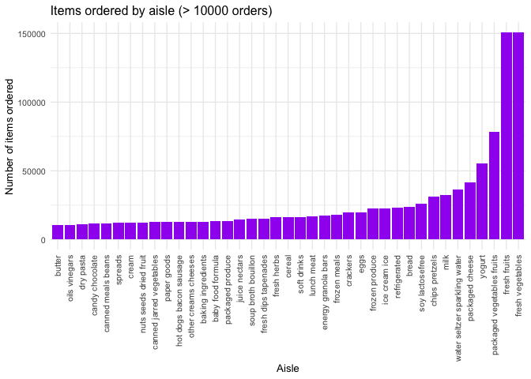

p8105_hw3_ym3077
================

Load packages

``` r
library(tidyverse)
```

    ## ── Attaching core tidyverse packages ──────────────────────── tidyverse 2.0.0 ──
    ## ✔ dplyr     1.1.4     ✔ readr     2.1.5
    ## ✔ forcats   1.0.0     ✔ stringr   1.5.1
    ## ✔ ggplot2   3.5.2     ✔ tibble    3.3.0
    ## ✔ lubridate 1.9.4     ✔ tidyr     1.3.1
    ## ✔ purrr     1.1.0     
    ## ── Conflicts ────────────────────────────────────────── tidyverse_conflicts() ──
    ## ✖ dplyr::filter() masks stats::filter()
    ## ✖ dplyr::lag()    masks stats::lag()
    ## ℹ Use the conflicted package (<http://conflicted.r-lib.org/>) to force all conflicts to become errors

## Problem 1

``` r
library(p8105.datasets)
data("instacart")

instacart_summary = list(instacart)
head(instacart,10)
```

    ## # A tibble: 10 × 15
    ##    order_id product_id add_to_cart_order reordered user_id eval_set order_number
    ##       <int>      <int>             <int>     <int>   <int> <chr>           <int>
    ##  1        1      49302                 1         1  112108 train               4
    ##  2        1      11109                 2         1  112108 train               4
    ##  3        1      10246                 3         0  112108 train               4
    ##  4        1      49683                 4         0  112108 train               4
    ##  5        1      43633                 5         1  112108 train               4
    ##  6        1      13176                 6         0  112108 train               4
    ##  7        1      47209                 7         0  112108 train               4
    ##  8        1      22035                 8         1  112108 train               4
    ##  9       36      39612                 1         0   79431 train              23
    ## 10       36      19660                 2         1   79431 train              23
    ## # ℹ 8 more variables: order_dow <int>, order_hour_of_day <int>,
    ## #   days_since_prior_order <int>, product_name <chr>, aisle_id <int>,
    ## #   department_id <int>, aisle <chr>, department <chr>

This `instacart` dataset has 1384617 observations for 131,209 users and
15 variables/rows, where each row represents a product from a single
order and is associated with a customer.  
The 15 variables in this dataset are: `order_id` (order identifier),
`product_id` (product identifier), `add_to_cart_order` (order of each
product was added to cart), `reordered` (1 if ordered before, 0
otherwise), `user_id` (customer identifier), `eval_set` (which
evaluation this order belongs to), `order_number` (the order number for
this user, 1=first, n=nth), `order_dow` (the day of the week when this
order was placed), `order_hour_of_day` (the hour of the day when this
order was placed), `days_since_prior_order` (days since the last order,
capped at 30, NA if order_number=1), `product_name` (name of the
product), `aisle_id`(aisle identifier), `department_id` (department
identifier), `aisle` (the name of the aisle), `department` (department
this product belongs to).

``` r
n_aisles = instacart |>
  distinct(aisle) |>
  nrow()

aisle_summary = instacart |>
  group_by(aisle) |>
  summarize(n_orders = n()) |>
  arrange(desc(n_orders))

n_aisles
```

    ## [1] 134

``` r
aisle_summary
```

    ## # A tibble: 134 × 2
    ##    aisle                         n_orders
    ##    <chr>                            <int>
    ##  1 fresh vegetables                150609
    ##  2 fresh fruits                    150473
    ##  3 packaged vegetables fruits       78493
    ##  4 yogurt                           55240
    ##  5 packaged cheese                  41699
    ##  6 water seltzer sparkling water    36617
    ##  7 milk                             32644
    ##  8 chips pretzels                   31269
    ##  9 soy lactosefree                  26240
    ## 10 bread                            23635
    ## # ℹ 124 more rows

There are 134 aisles on the dataset, and fresh vegetables is the aisle
with the most items ordered from.

Plot the number of items ordered in each aisle (\>10000 orders)

``` r
aisle_plot = instacart |>
  group_by(aisle) |>
  summarize(n_orders = n()) |>
  filter(n_orders > 10000) |>
  mutate(aisle = fct_reorder(aisle, n_orders)) 

ggplot(aisle_plot, aes(x = aisle, y = n_orders)) + 
  geom_col(fill = "purple") +
  labs(
    title = "Items ordered by aisle (> 10000 orders)",
    x = "Aisle",
    y = "Number of items ordered") +
  theme_minimal(base_size = 10) +
  theme(axis.text.x = element_text(angle = 90, hjust = 1, vjust = 0.5))
```

<!-- -->

Table with three most popular items in “baking ingredients”, “dog food
care”, and “packaged vegetables fruits”

``` r
pop_items = instacart |>
  filter(aisle %in% c("baking ingredients", "dog food care", "packaged vegetables fruits")) |>
  group_by(aisle, product_name) |>
  summarize(n_orders = n()) |>
  arrange(aisle, desc(n_orders)) |>
  slice_head(n=3)
```

    ## `summarise()` has grouped output by 'aisle'. You can override using the
    ## `.groups` argument.

``` r
pop_items
```

    ## # A tibble: 9 × 3
    ## # Groups:   aisle [3]
    ##   aisle                      product_name                               n_orders
    ##   <chr>                      <chr>                                         <int>
    ## 1 baking ingredients         Light Brown Sugar                               499
    ## 2 baking ingredients         Pure Baking Soda                                387
    ## 3 baking ingredients         Cane Sugar                                      336
    ## 4 dog food care              Snack Sticks Chicken & Rice Recipe Dog Tr…       30
    ## 5 dog food care              Organix Chicken & Brown Rice Recipe              28
    ## 6 dog food care              Small Dog Biscuits                               26
    ## 7 packaged vegetables fruits Organic Baby Spinach                           9784
    ## 8 packaged vegetables fruits Organic Raspberries                            5546
    ## 9 packaged vegetables fruits Organic Blueberries                            4966
